  
```{r setup, include=FALSE}
library(tm)
library(wordcloud)
library(RColorBrewer)
library(cowplot)
library(ggplot2)
library(plotly)
library(tidyverse)
library(crosstalk)
library(GGally)
olive <- read.csv("olive.csv")
```

# Assignment 1. Text Visualization of Amazon reviews. 

### Assignment 1.1

### Five File

```{r 1.1, echo=FALSE}
data<-read.table("Five.txt",header=F, sep='\n') 
data$doc_id=1:nrow(data)
colnames(data)[1]<-"text"
mycorpus <- Corpus(DataframeSource(data)) 
mycorpus <- tm_map(mycorpus, removePunctuation)
mycorpus <- tm_map(mycorpus, function(x) removeWords(x, stopwords("english")))
tdm <- TermDocumentMatrix(mycorpus)
m <- as.matrix(tdm)
v <- sort(rowSums(m),decreasing=TRUE)
d <- data.frame(word = names(v),freq=v) 
pal <- brewer.pal(6,"Set2")
wordcloud(d$word,d$freq, scale=c(8,.3),min.freq=2,max.words=500, random.order=F, rot.per=.15, colors=pal, vfont=c("sans serif","plain"))
```

### OneTwo File

```{r 1.2, echo=FALSE}
data1<-read.table("OneTwo.txt",header=F, sep='\n') 
data1$doc_id=1:nrow(data1)
colnames(data1)[1]<-"text"
mycorpus2 <- Corpus(DataframeSource(data1)) 
mycorpus2 <- tm_map(mycorpus2, removePunctuation)
mycorpus2 <- tm_map(mycorpus2, function(x) removeWords(x, stopwords("english")))
tdm2 <- TermDocumentMatrix(mycorpus2)
m2 <- as.matrix(tdm2)
v2 <- sort(rowSums(m2),decreasing=TRUE) 
d2<- data.frame(word = names(v2),freq=v2)
pal2 <- brewer.pal(6,"Pastel1")
wordcloud(d2$word,d2$freq, scale=c(8,.3),min.freq=2,max.words=500, random.order=F, rot.per=.15, colors=pal2, vfont=c("sans serif","plain"))
```

### Comment 
Here we have two-word graphs describing customers feedback for a specific type of watch, the first graph shows the feedback from customers who were  pleased by the service and the second one for those who were not, the fist word cloud shows that most of the customers were satisfied by the watch price and the number of year that it last with them, they also described it as great in the way it’s look, some of them mentioned the battery life time and the watch band as major reasons of their satisfaction.
On the other hand, the unsatisfied customers mentioned that battery, analog and the replace policy one of the major reasons of their un satisfaction, in addition many of them wanted to retrieve it back to the store, one of the main reasons can be considered for their unpleasant the mentioned that the watch stopped suddenly.


### Assignment 1.2

## Five File

##### Phrase nets for Five.Txt with connector words (at) and (of)
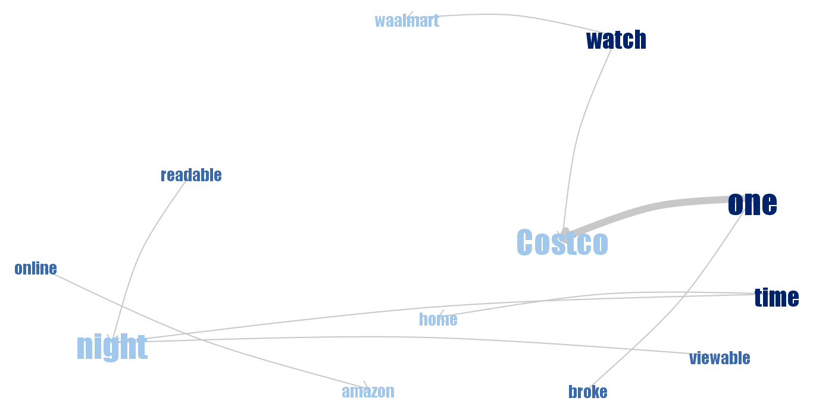{width=50%}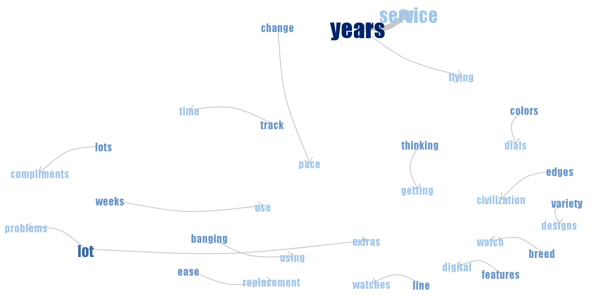{width=50%}

##### Phrase nets for Five.Txt with connector words (am,is,are,was,were) and (at,the)

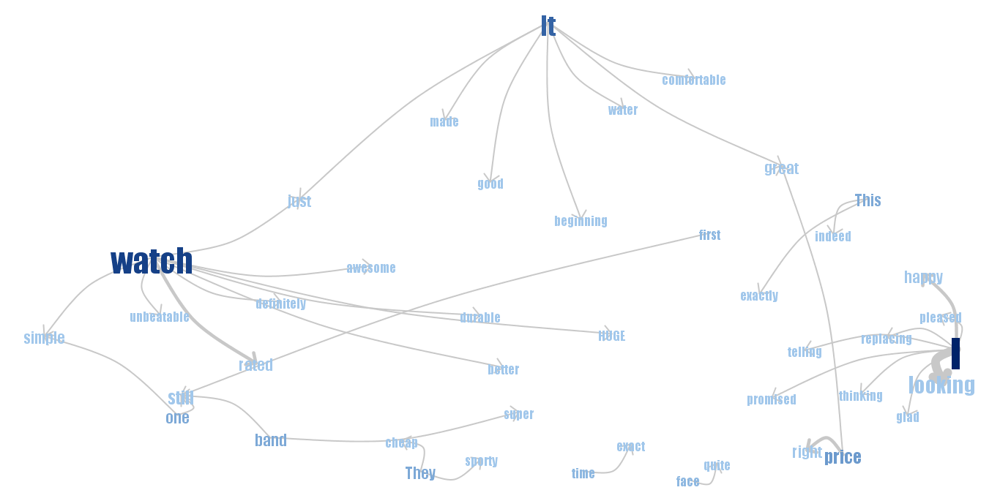{width=50%}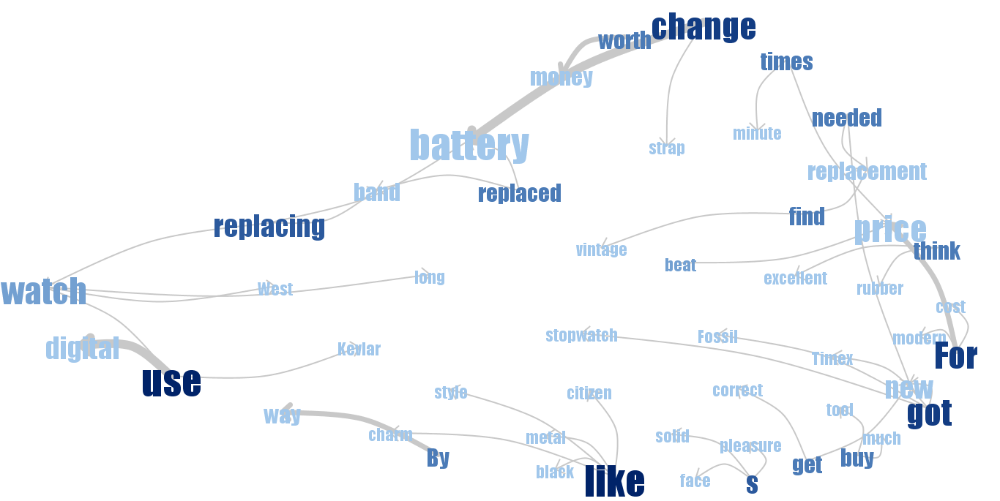{width=50%}

## OneTow File

##### Phrase nets for OneTow.Txt with connector words (at) and (of)

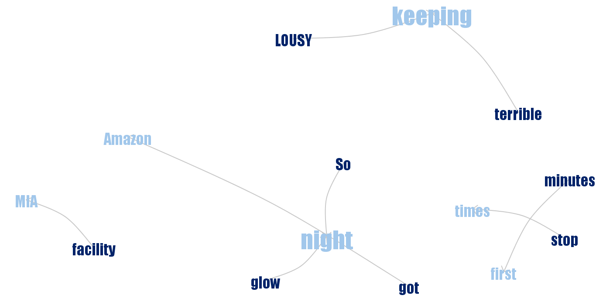{width=50%}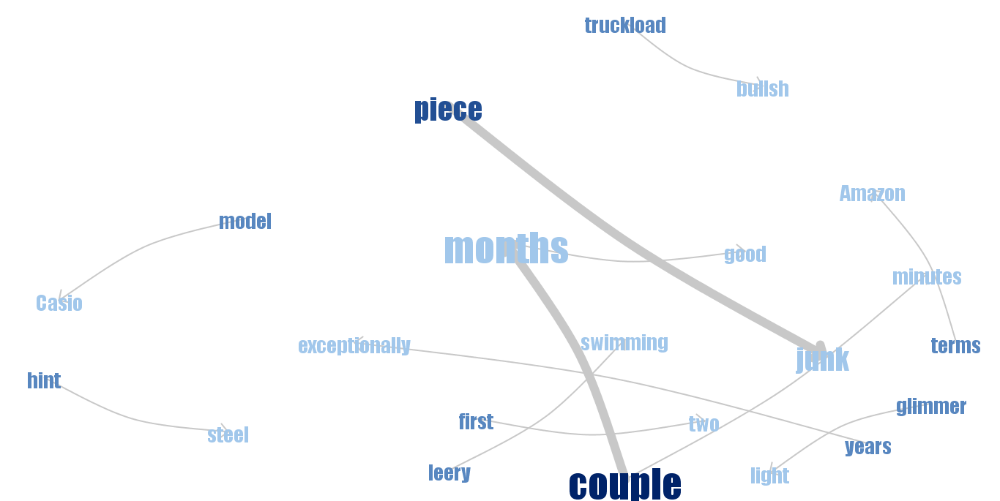{width=50%}

##### Phrase nets for OneTow.Txt with connector words (am,is,are,was,were) and (at,the)

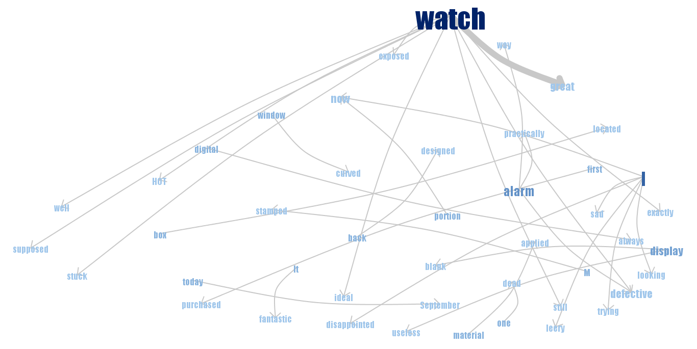{width=50%}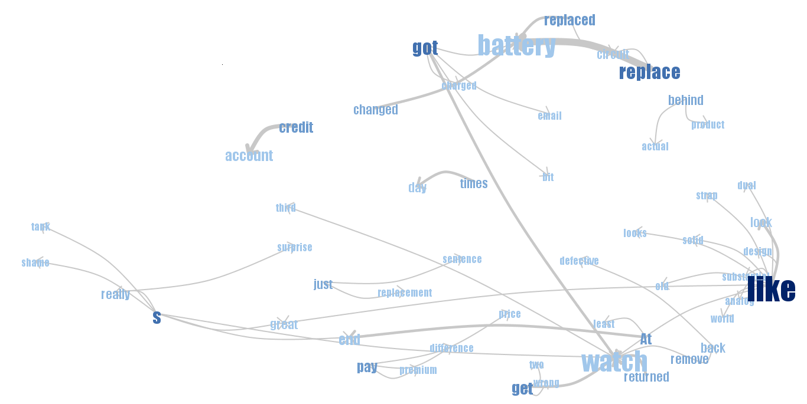{width=50%}

### Assignment 1.3

### Use Word Trees to understand the context better

##### Which properties of this watch are mentioned mostly often? 
1-	Workhorse and extremely accurate.   
2-	Looks like classic dive watch.   
3-	Unbeatable and surpasses any watch in it’s price range.  
4-	The biggest submariner-watch you're find.  
5-	Great price.  
6-	Rated 100m water resistant.  

##### What are satisfied customers talking about? 
1-	Cheap and last forever, it’s quality and comfortable watch to wear.  
2-	Durable, useful and very hard to top.  
3-	Easy to read in poor lighting situations and in day time.  
4-	Not too big, an ana-digi watch with dual time, waterproof.  

##### What are unsatisfied customers talking about? 
1-	Lousy at keeping accurate time.  
2-	Unmanageable and alarm is unusable.  
3-	The battery.  
4-	The analog, and the digital part.   

##### What are good and bad properties of the watch mentioned by both groups? 
1-	Good properties:  
-	Great deal (Price).  
-	A Dive watches.  
-	The Digital display.  
-	The Band.  
2-	Bad properties:  
-	The analog.  
-	The battery.   
-	The alarm.  

##### Can you understand watch characteristics (like type of display, features of the watches) by observing these graphs? 
It’s easy to determine the type of the watch as the customer described it on their comments, for example it was easy to know the watch have both digital and analog display while the band was made of rubber, and the numbers made of crystals.

## Assignment 2.1
```{r 2_1}
p1 <- plot_ly(data = olive, x = ~eicosenoic, y = ~linoleic) %>%
  add_markers()
p1
```

The scatter plot shows that about a half of the observations have eicosenoic values that are 3 or lower, while the remaining observations have eicosenoic values that are 10 or higher.

## Assignment 2.2
```{r 2_2, warning=FALSE, message=FALSE, fig.align='center'}
d <- SharedData$new(olive)

p2_1 <- plot_ly(data = d, x = ~eicosenoic, y = ~linoleic) %>%
  add_markers()

p2_2 <- plot_ly(d, x = ~as.factor(Region)) %>%
  add_histogram() %>%
  layout(barmode="overlay")

bscols(widths = c(2, NA), filter_slider("stearic", "Stearic", d, ~stearic),
       subplot(p2_1, p2_2) %>%
         highlight(on = "plotly_select", dynamic = T, persistent = T, opacityDim = I(1)) %>%
         hide_legend())
```


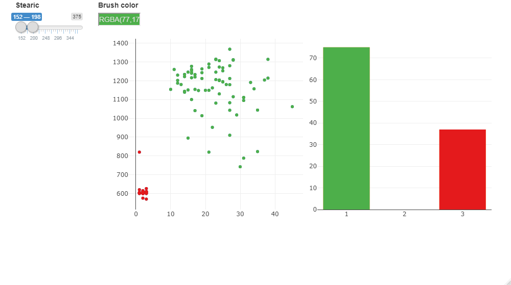
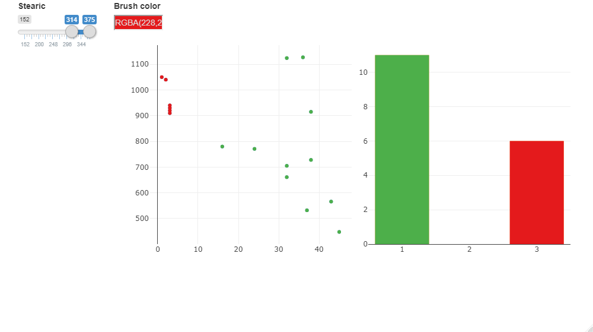

By using persistent brushing, it can be found that all observations belonging to regions 2 and 3 have eicosenoic values that are 3 or less, which is unusually low. All observations belonging to region 1 have eicosenoic values that are 10 or higher.

The plots also shows that all observations from region 2 have linoleic values that are 1057 or higher, while observations from region 3 have linoleic values that are 1050 or lower.

By using the slider to filter observations by stearic values, it appears that regions 1 and 3 have more observations with very high, and very low values of stearic. In region 3, observations that have low stearic values also appears to have low values of eicosenoic and linoleic, while observations with high stearic values tend to have high values of linoleic.

Four interaction operators were used in this step: navigation, selection, connection (brushing) and filtering (a slider).

## Assignment 2.3
```{r 2_3, warning=FALSE, message=FALSE}
p3_1 <- plot_ly(data = d, x = ~eicosenoic, y = ~linoleic) %>%
  add_markers()

p3_2 <- plot_ly(data = d, x = ~arachidic, y = ~linoleic) %>%
  add_markers()

subplot(p3_1, p3_2) %>%
  highlight(on = "plotly_select", dynamic = T, persistent = T, opacityDim = I(1)) %>%
  hide_legend()
```

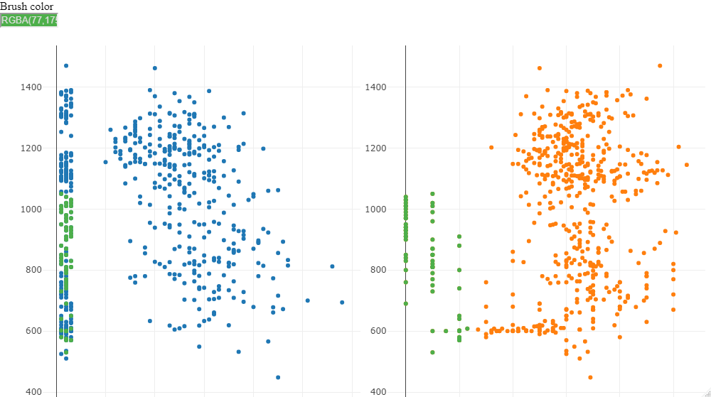

All observation with unusually small values for arachidic also has unusually small values for eicosenoic. The reverse relationship is not necessarily true though, as there exists observations that have unusually low eicosenoic values that do not have unusually low arachidic values.

## Assignment 2.4
```{r 2_4, warning=FALSE, message=FALSE}
parcoord <- ggparcoord(olive, columns = c(4:11))

d <- plotly_data(ggplotly(parcoord)) %>%
  group_by(.ID)

d1 <- SharedData$new(d, ~.ID, group = "acid")

p4_1 <- plot_ly(d1, x = ~variable, y = ~value) %>%
  add_lines(line = list(width = 0.3)) %>%
  add_markers(marker = list(size = 0.3),
              text = ~.ID, hoverinfo = "text")

olive2 <- olive[,c(2,4:11)]
olive2$.ID <- 1:nrow(olive)
d2 <- SharedData$new(olive2, ~.ID, group = "acid")

ButtonsX = list()
for(i in 4:11) {
  ButtonsX[[i-3]] = list(method = "restyle",
                         args = list("x", list(olive[[i]])),
                         label = colnames(olive)[i])
}

ButtonsY = list()
for(i in 4:11) {
  ButtonsY[[i-3]] = list(method = "restyle",
                         args = list("y", list(olive[[i]])),
                         label = colnames(olive)[i])
}

ButtonsZ = list()
for(i in 4:11) {
  ButtonsZ[[i-3]] = list(method = "restyle",
                         args = list("z", list(olive[[i]])),
                         label = colnames(olive)[i])
}

p4_2 <- plot_ly(d2, x = ~palmitic, y = ~stearic, z = ~oleic, alpha = 0.8) %>%
  add_markers() %>%
  layout(scene = list(xaxis = list(title = "") , yaxis = list(title = ""), zaxis = list(title = "")),
         title = "Select variable:",
         updatemenus = list(
           list(y=0.9, buttons = ButtonsX),
           list(y=0.6, buttons = ButtonsY),
           list(y=0.3, buttons = ButtonsZ))
  )
p4_2

p4_3 <- plot_ly(d2, x = ~as.factor(Region)) %>%
  add_histogram() %>%
  layout(barmode = "overlay")

ps <- htmltools::tagList(p4_1 %>%
                         highlight(on = "plotly_select", dynamic = T, persistent = T, opacityDim = I(1)) %>%
                         hide_legend(),
                       p4_2 %>%
                         highlight(on = "plotly_select", dynamic = T, persistent = T, opacityDim = I(1)) %>%
                         hide_legend(),
                       p4_3 %>%
                         highlight(on = "plotly_select", dynamic = T, persistent = T, opacityDim = I(1)) %>%
                         hide_legend()
)
htmltools::browsable(ps)
```

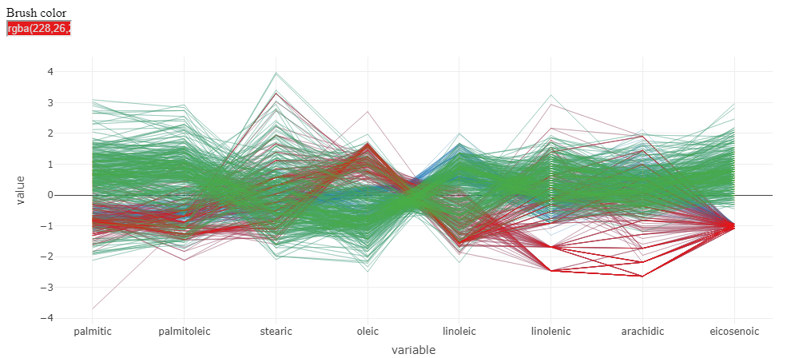
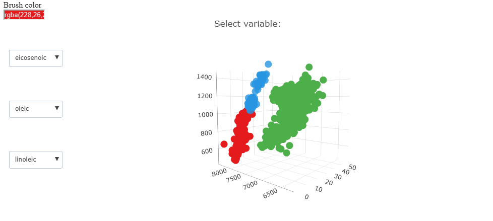

The parallel coordinate plot demonstrates that there are clusters among the observations that belong to the same region. By studying the parallel coordinate plot, it appears that eicosenoic is the variable that is best at differentiating between region 1 and regions 2 and 3. Region 1 tend to have high eicosenoic values while regions 2 and 3 tend to have low values. For differentiating between regions 2 and 3, linoleic seems to be the best choice. Region 2 tend to have high linoleic values, while region 3 tend to have low values.

Since linoleic does not appear to be as good at differentiating between regions 2 and 3 as eicosenoic is at differentiating between region 1 and regions 2 and 3, another variable that can be used to differentiate between regions 2 and 3 is probably the most appropriate choice as the third variable. Oleic can be used to differentiate between regions 2 and 3, as region 2 tend to have values close to or less than 0, while region 3 tend to have higher values.

By selecting these three influential variables in the drop boxes in the 3d scatter plot, three quite clearly separated clusters representing each regions appear.

## Assignment 2.5
Four interaction operators were used in step 4: navigation, selection, connection (brushing) and reconfiguring (dropdown boxes). Step 2 showed that a filtering operator in the form of a slider for filtering observations by their stearic values can be useful to determine which region different oils come from.


### Appendix
```{r eval=FALSE}
library(tm)
library(wordcloud)
library(RColorBrewer)
library(plotly)
library(tidyverse)
library(crosstalk)
library(GGally)


#Five_File
data<-read.table("Five.txt",header=F, sep='\n') 
data$doc_id=1:nrow(data)
colnames(data)[1]<-"text"
mycorpus <- Corpus(DataframeSource(data)) 
mycorpus <- tm_map(mycorpus, removePunctuation)
mycorpus <- tm_map(mycorpus, function(x) removeWords(x, stopwords("english")))
tdm <- TermDocumentMatrix(mycorpus)
m <- as.matrix(tdm)
v <- sort(rowSums(m),decreasing=TRUE)
d <- data.frame(word = names(v),freq=v) 
pal <- brewer.pal(6,"Set2")
wordcloud(d$word,d$freq, scale=c(8,.3),min.freq=2,max.words=500, random.order=F, rot.per=.15, colors=pal, vfont=c("sans serif","plain"))

#OneTwo File
data1<-read.table("OneTwo.txt",header=F, sep='\n') 
data1$doc_id=1:nrow(data1)
colnames(data1)[1]<-"text"
mycorpus2 <- Corpus(DataframeSource(data1)) 
mycorpus2 <- tm_map(mycorpus2, removePunctuation)
mycorpus2 <- tm_map(mycorpus2, function(x) removeWords(x, stopwords("english")))
tdm2 <- TermDocumentMatrix(mycorpus2)
m2 <- as.matrix(tdm2)
v2 <- sort(rowSums(m2),decreasing=TRUE) 
d2<- data.frame(word = names(v2),freq=v2)
pal2 <- brewer.pal(6,"Pastel1")
wordcloud(d2$word,d2$freq, scale=c(8,.3),min.freq=2,max.words=500, random.order=F, rot.per=.15, colors=pal2, vfont=c("sans serif","plain"))
olive <- read.csv("olive.csv")

#### 2.1 ####

p1 <- plot_ly(data = olive, x = ~eicosenoic, y = ~linoleic) %>%
  add_markers()
p1

#### 2.2 ####

d <- SharedData$new(olive)

p2_1 <- plot_ly(data = d, x = ~eicosenoic, y = ~linoleic) %>%
  add_markers()

p2_2 <- plot_ly(d, x = ~as.factor(Region)) %>%
  add_histogram() %>%
  layout(barmode="overlay")

bscols(widths = c(2, NA), filter_slider("stearic", "Stearic", d, ~stearic),
       subplot(p2_1, p2_2) %>%
         highlight(on = "plotly_select", dynamic = T, persistent = T, opacityDim = I(1)) %>%
         hide_legend())

#### 2.3 ####

p3_1 <- plot_ly(data = d, x = ~eicosenoic, y = ~linoleic) %>%
  add_markers()

p3_2 <- plot_ly(data = d, x = ~arachidic, y = ~linoleic) %>%
  add_markers()

subplot(p3_1, p3_2) %>%
  highlight(on = "plotly_select", dynamic = T, persistent = T, opacityDim = I(1)) %>%
  hide_legend()

#### 2.4 ####

parcoord <- ggparcoord(olive, columns = c(4:11))

d <- plotly_data(ggplotly(parcoord)) %>%
  group_by(.ID)

d1 <- SharedData$new(d, ~.ID, group = "acid")

p4_1 <- plot_ly(d1, x = ~variable, y = ~value) %>%
  add_lines(line = list(width = 0.3)) %>%
  add_markers(marker = list(size = 0.3),
              text = ~.ID, hoverinfo = "text")

olive2 <- olive[,c(2,4:11)]
olive2$.ID <- 1:nrow(olive)
d2 <- SharedData$new(olive2, ~.ID, group = "acid")

ButtonsX = list()
for(i in 4:11) {
  ButtonsX[[i-3]] = list(method = "restyle",
                         args = list("x", list(olive[[i]])),
                         label = colnames(olive)[i])
}

ButtonsY = list()
for(i in 4:11) {
  ButtonsY[[i-3]] = list(method = "restyle",
                         args = list("y", list(olive[[i]])),
                         label = colnames(olive)[i])
}

ButtonsZ = list()
for(i in 4:11) {
  ButtonsZ[[i-3]] = list(method = "restyle",
                         args = list("z", list(olive[[i]])),
                         label = colnames(olive)[i])
}

p4_2 <- plot_ly(d2, x = ~palmitic, y = ~stearic, z = ~oleic, alpha = 0.8) %>%
  add_markers() %>%
  layout(scene = list(xaxis = list(title = "") , yaxis = list(title = ""), zaxis = list(title = "")),
         title = "Select variable:",
         updatemenus = list(
           list(y=0.9, buttons = ButtonsX),
           list(y=0.6, buttons = ButtonsY),
           list(y=0.3, buttons = ButtonsZ))
  )
p4_2

p4_3 <- plot_ly(d2, x = ~as.factor(Region)) %>%
  add_histogram() %>%
  layout(barmode = "overlay")

ps <- htmltools::tagList(p4_1 %>%
                         highlight(on = "plotly_select", dynamic = T, persistent = T, opacityDim = I(1)) %>%
                         hide_legend(),
                       p4_2 %>%
                         highlight(on = "plotly_select", dynamic = T, persistent = T, opacityDim = I(1)) %>%
                         hide_legend(),
                       p4_3 %>%
                         highlight(on = "plotly_select", dynamic = T, persistent = T, opacityDim = I(1)) %>%
                         hide_legend()
)
htmltools::browsable(ps)
```


## Statement of Contribution
Simon and Mohamed devised the whole assignment together, the main conceptual ideas and codes outline. Mohamed worked out Assignment 1 (Text Visualization of Amazon reviews), and the report creation using r markdown, Simon worked out Assignment 2 (Interactive analysis of Italian olive oils).
